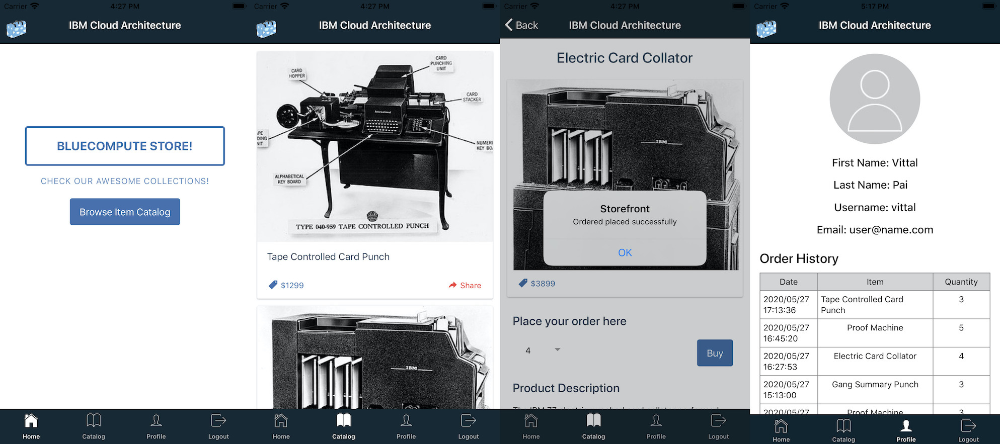

Storefront Ionic Mobile Application
===
## Overview
This is a IBM Mobile Foundation based Ionic Mobile Application frontend to the storefront application.  The application allows mobile app users to browse the storefront catalog items, make an order and review profile.

### Pre-requisites
- Ionic CLI Version 5.4.16
- Storefront server components installed and running - microservices, dependent DBs, IBM Mobile Foundation 

### Usage
1. Edit ionic/config.xml file and update the element <mfp:server runtime="mfp" url="<url for mobile foundation server" /> for the url endpoint of the Mobile Foundation server
2. From a command-line window, navigate to the project's root folder and run the commands:
    - `cd ionic` - to navigate to application folder
    - `ionic cordova platform add ios` or `ionic cordova platform add androids` - to add a platform.
    - `ionic cordova run` - to run the application.

3. Run the application to view the catalog, make an order and review the user profile.
 

### Version
ionic-angular 3.9.2

### Supported Levels
IBM MobileFirst Platform Foundation 8.0

